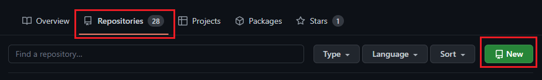
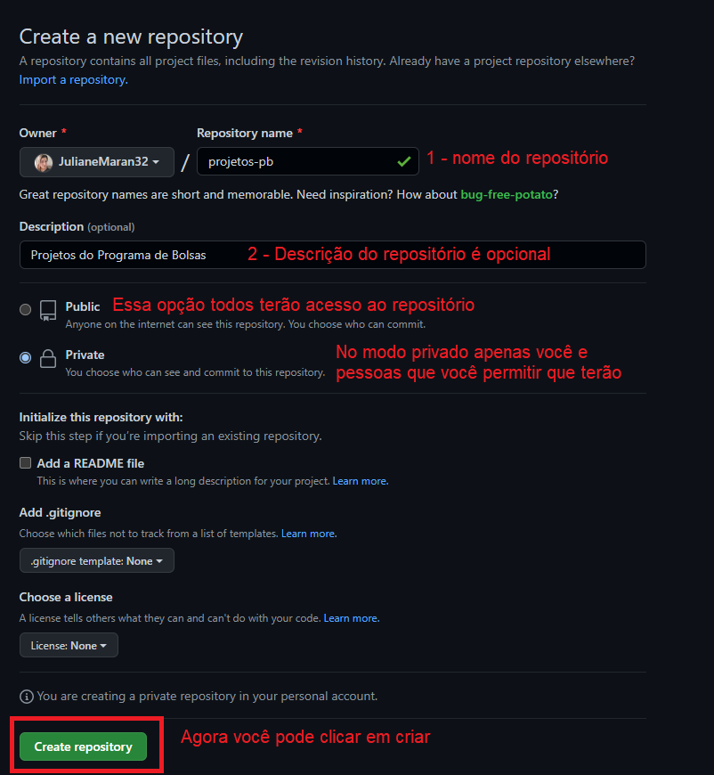
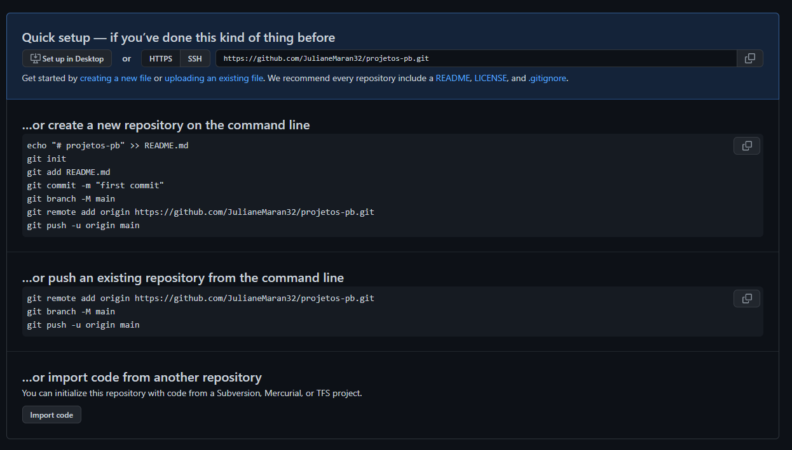

<h2>COMANDOS GIT</h2>


<h3>Criando repositório</h3>

Para criar um repositório no github, você pode seguir os passoas abaixo.

   



Hmmmmm.... e essa tela aqui???



Vamos lá... primeiro vou explicar o que significa cada comando e depois vamos clonar o projeto na nossa máquina  

```bash
# serve para inicializar
git init

# adiciona um arquivo específico
git add README.md

# fazemos o commit do arquivo adicionado, podemos incluir uma descrição que fique fácil de entender depois
git commit -m "first commit"

# 
git branch -M main

# desfazer alterações que ainda NÃO foram commitadas
git checkout .

# atualizar repositório local
git pull

# atualizar repositório de acor com a master
git pull origin master

# alterações feitas - NÃO commitadas
git status

# adicionando UM arquivo para o commit
git add NomeDoArquivo

# adicionando TODOS os arquivos
git add .

# Trocar de branch SEM commitar alguma alteração incompleta
git stash

# recuperar arquivos que ficaram armazenados na pilha
git stash apply


# enviar alterações locais para remoto
git push

```


<h3>Clonando repositório</h3>


```bash
# clonar repositório  
git clone https://github.com
```

Ao entrar num repositório no Github, você irá ver a opção "Code", clicando nela veremos o nome "Clone".   
Escolha a opção "HTTPS" e copiando a URL, como na figura abaixo:     

  

Colamos essa URL no "prompt de comando" ou "cmd"   

  

Pronto! Agora você pode visualizar na pasta o repositório clonado 

  


```bash
# criar branch e entrar na branch
git checkout -b NomeDaBranch

# deletar branch
git branch -d NomeDaBranch

# trocar de branch
git checkout NomeDaBranch

# desfazer alterações que ainda NÃO foram commitadas
git checkout .

# atualizar repositório local
git pull

# atualizar repositório de acor com a master
git pull origin master

# alterações feitas - NÃO commitadas
git status

# adicionando UM arquivo para o commit
git add NomeDoArquivo

# adicionando TODOS os arquivos
git add .

# Trocar de branch SEM commitar alguma alteração incompleta
git stash

# recuperar arquivos que ficaram armazenados na pilha
git stash apply

# fazer commit
git commit -m "escreva as alterações feitas"

# enviar alterações locais para remoto
git push

```